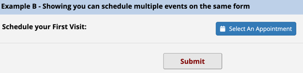
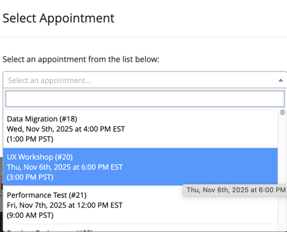
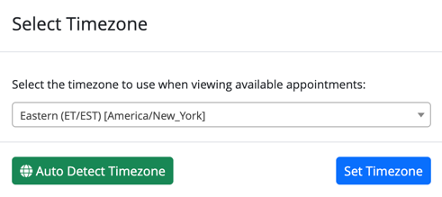
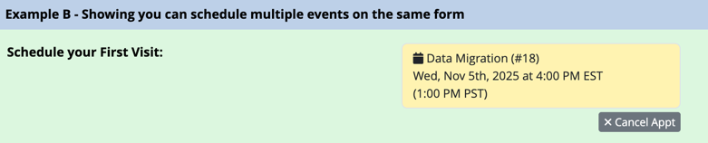
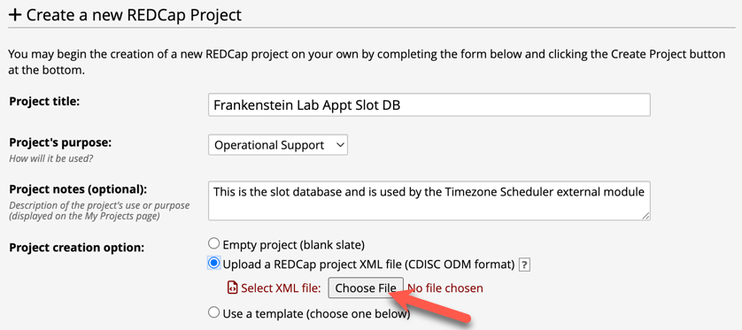
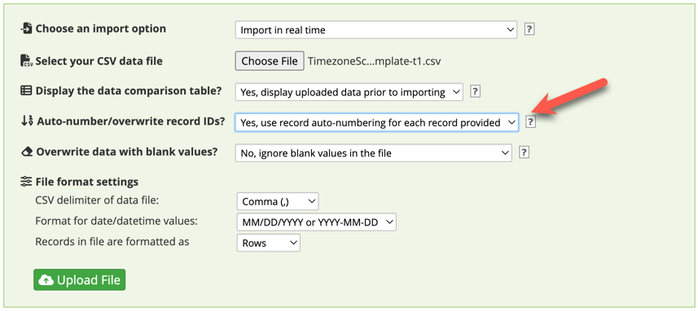

# REDCap module: Timezone Scheduler

This REDCap module allows participants (via survey or data entry form) to select an appointment from a database of available appointment.  Further, it permits the user to view the available times in their local or custom-selected timezone.

This makes it easy for multi-timezone studies to schedule appointments with participants in their own timezone.

The module also contains a number of customizations that allow project designers to send notifications to participants with appointment details in their own timezone.

## Details
This module converts a text field into an appointment selector button:



You then select available appointments from a list.  Each appointment is shown in your local time (EST in example) as well as SERVER time (PST in this case)



You can also change your timezone (defaults to browser timezone) and appointment lists are automatically converted:



Example of a booked appointment:



### Disclaimer
There are a lot of potential configuration options, so it can be a little overwhelming at first.  However, if you look at the examples provided, it can be configured with minimal complexity.

### Prerequisites
- A modern version of [REDCap](https://project-redcap.org).

### Easy Installation of this Module
- Obtain this module from the Consortium [REDCap Repo](https://redcap.vanderbilt.edu/consortium/modules/index.php) from the control center.

### Manual Installation of this Module
- Clone this repo into `<redcap-root>/modules/timezone_scheduler_v0.0.0`.
- Go to **Control Center > External Modules** and enable Timezone Scheduler.
- To activate this module for a particular project, go to the project home page, click on the **External Modules** link, and then enable Timezone Scheduler for that project.  Note: this may not be available if your REDCap administrator has hidden or requires approval to enable External Modules.

## Getting Started
Your first time using this module, I recommend following these steps:

1. Create the Slot Database
2. Populate the Slot Database
3. Create an Example Project
4. Enable and Configure the Timezone Scheduler EM on the Example Project
5. Test

### 1. Create the Slot Database
Prior to enabling this external module on a project, you need to create a Slot Database.  The Slot Database *DOES NOT* use the external module and it is not necessary to enable the external module on the Slot Database project.  The easiest way to create a compliant slot database is to use the provided [REDCap Slot DB Project XML File](./docs/TimezoneSchedulerSlotDbTemplate.REDCap.xml).  In the future, you can make copies of this database for other projects (or re-import from scratch).

Goto REDCap, select `Create a new REDCap Project`, and then chose the `Upload a REDCap project XML file` and use the file from above.



### 2. Populate the Slot Database
Once you have your new slot database, use the [Import Template](./docs/TimezoneSchedulerImportTemplate.csv) to create an then import a number of available slots.

> [!NOTE] AI Fun for Generating Test Events
> Have [fun with AI](https://www.perplexity.ai/search/based-on-the-template-below-ge-a3axFQDEQaWkRBSuN.PuUQ#0) to generate some test events.
> This is a set of [100 future events](./docs/ExampleEventsFun.csv) you can also use.

> [!NOTE] Use Force Auto Numbering On Import!
> It is important to never reuse the `slot_id` field.  For this reason, I always recommend importing with the `Force Auto Number` option.  See the image below:
> 
> If you're import csv uses the slot_ids 1..100 and you already have slots 1-50.  REDCap will automatically autonumber each new row so your 50 existing slots will remain unchanged and the new 100 slots will be numbered 51-151.  As another test, you can re-import the same text file many times and with Force Auto-Numbering it will not overwrite any events.

### 3. Create an Example Project
To illustrate (and test) that this module works with classical, longitudinal, and repeating forms, I created a test project.  You can [download the XML](./docs/TimezoneSchedulerExample.REDCap.xml).
This example shows a variety of possible configurations but also requires a somewhat painstaking configuration in step 5.

### 4. Enable and Configure the Timezone Scheduler EM on the Example Project
Enable the `Timezone Scheduler vx.y.z` em on your the example project.  Goto the configuration page.
 The example project contains 6 different configurations.  This is more than most projects will ever user, so this is the exact configuration:

1. Click on `Configure` from the External Modules page in the Example Project
2. Select the `Timezone Database` you wish to use.  Leave Blank for all Timezones.  You can edit this later.
3. Since we have 6 total configurations, you need to press the '+' button next to configuration 1 **five** more times.
4. Configure each as follows:
   1. Example A:
      - Slot DB => The PID for your Slot Database created in Step 1 - this will be the same for all 6 configurations.
      - Appointment Field => `appt_slot_1`
      - Appointment Field Event => `Arm_1_Event_1`
      - Appointment Button Label => leave blank or put something there if you want to test it out
      - Appointment Server DateTime Field => `appt_server_dt_1`
      - Appointment Appointment Description Format => leave blank, you can come back later and play with this if you like...
      - Appointment Description Field => `appt_description_1`
      - Slot Filter Field => `appt_slot_filter_1`
      - Appointment Participant Text Date Field => `appt_part_text_date_1`
      - Cancel Appointment URL => `appt_cancel_url_1`
      - Slot Record URL => `appt_slot_url_1`
      > [!NOTE] Whew!
      > That was the full set of options.  The others are much simpler.
   2. Example B Appt 1
      - Slot DB => same as before
      - Appointment Field => `ex_b_appt_1`
      - Event => Event 1
      - Appointment Server DateTime Field => `ex_b_appt_dt_1`
      - Appointment Description Field => `ex_b_appt_description_1`
      - Cancel Appointment URL => `ex_b_appt_cancel_url_1`
   3. Example B Appt 2
      - Slot DB => same as before
      - Appointment Field => `ex_b_appt_2`
      - Event => Event 1
      - Appointment Server DateTime Field => `ex_b_appt_dt_2`
      - Appointment Description Field => `ex_b_appt_description_2`
      - Cancel Appointment URL => `ex_b_appt_cancel_url_2`
   4. Example C (first event)
      - Slot DB => same as before
      - Appointment Field => `ex_c_appt`
      - Event => Event 1
      - Appointment Server DateTime Field => `ex_c_appt_dt`
   5. Example D (repeating instances)
      - Slot DB => same as before
      - Appointment Field => `ex_d_appt`
      - Event => Event 1
      - Appointment Server DateTime Field => `ex_d_appt_dt`
   6. Example C (second event)
      - Slot DB => same as before
      - Appointment Field => `ex_c_appt`
      - Event => **Event 2**
      - Appointment Server DateTime Field => `ex_c_appt_dt`

Perhaps, in retrospect, I should have started with just a simple example.  The order in the configuration doesn't matter, so you could skip to one of the easier ones first.

### 5. Testing
Now you should be able to create a record or goto the public survey url for the project and start experimenting around.

## Error and Debug Configuration
This external module uses the [emLogger module](https://github.com/susom/redcap-em-logger) to write DEBUG, INFO, and ERROR messages to a file on your server.  It is not required for operation, but can be useful for troubleshooting.  If you have `emLogger` installed and configured, you can enable it either system-wide or project-wide in the external module configuration.  If enabled on a project, javascript debugging will also be enabled and you should see messages in the browser javascript console.


## Terminology ###
A bit about terminology here:

- A SLOT is a potential meeting date/time.  You start by creating a database of potential meeting times, called the Slot DB.
- The term Appointment Field, refers to a survey project where you want a user to pick a SLOT and reserve it for their record.  Once the slot is reserved, it then has a linked Appointment entry.  It can be confusing... sorry.


## About the Slot Database Project(s)

Slot DB Projects should be created from the [REDCap Slot DB Project XML File](./docs/TimezoneSchedulerSlotDbTemplate.REDCap.xml) or copied from an existing Slot DB.

The required fields should not be modified nor should the name of the form (slots) or the project type (classical).

The Slot Database uses one record per 'slot'.  Each slot will:
| Field | Purpose |
| ----- | ------- |
| title | A descriptive title for the appointment, such as `30 Minute Onboarding` |
| date | The date for the appointment in the server's timezone as `yyyy-mm-dd` |
| time | The time, in server's timezone |
| project_filter | If set, only records from that project_id will be able to use the slot |
| slot_filter | Slot Filter Value -- If set, only records that contain the same value in the record field configred as `slot-filter-field` will be able to use the slot (see [details below](###using-the-slot-filter-field###) |

Once a slot is 'reserved', there are a number of fields that track which record/event/instance/field reserved the slot.
| Field | Purpose |
| --- | --- |
| reserved_ts | The timestamp when the slot was reserved |
| source project id | Points back to the project that reserved the slot (note, you can share a single SlotDB with many study projects) |
| source project title | The title of the project who reserved teh slot (just to reduce confusion when going by project_ids alone) |
| source record id | The record in the appointment project |
| source field | The field in the appointment project |
| source event id | The event_id (useful if longitudinal) |
| source instance id | Useful if you have an appointment field on a repeating form |
| source record url | A redirect url to open the appointment record.  This can be piped into a button on a descriptive field |
| participant timezone | The timezone of the end user who booked the appointment |
| participant description | The 'fancy' format of the appointment as configured in the client project |

## About the Appointment Project(s)
In a project where you want to use this EM, you will have to enable the EM and then configure a number of things for each of these projects.

> [!NOTE] Multi-database Support
> It is possible to have multiple appointments pointing to multiple slot databases within a single project.  For example, if you have a single database for informed consent appointments you could link all of your lab's projects to pull slots from this database.  But, if you also had a project that needed a second class of appointments for lab draws, you could connect that form/field to a DIFFERENT slot database.


| Setting | Description |
| --- | ---- |
| Timezone Database | As a global setting across all scheduled appotintments in the project, you can select how many timezones you wish to display.  It is recommended to select the group that represents your sample size.  Note that someone who has a browser from a different timezone can still use their client-timezone even if it doesn't appear in the dropdown |
| Slot DB Project ID | Enter the project_id on this server that contains the database of available reservation slots, created per instructions above.  |
| Appointment Field | This field will display a button to select an available slot or a summary of the scheduled appointment.  The field will store the <code>slot_id</code> of the appointment and should be of type text |
| Appointment Field Event | Select the event where the Appointment Field above resides.<ul><li><i>If you wish to use the same Appointment Field in a form that is enabled on multiple events, you must create a configuration instance for each event</i></li></ul> |
| Appointment Button Label | *(Optional)* Customize the text label on the appointment button |
| Appointment Server DateTime Field | *(Optional)* If specified, the **server timestamp** for this appointment will be stored.  This can be used to automate reminders to the participant using datediff logic and notifications.  <ul><li>validate as <b>Y-M-D H:M</b>, any other format may cause errors.</li><li>field must present in the Appointment Field Event</li><li>recommended to use <code>@HIDDEN-SURVEY</code> or place this field on a different instrument so the participant does not see it in the survey</li></ul> |
| Override Appointment Description Format | *(Optional)* This is how the appointment will be summarized and seen by the participant.  If blank, a default format is used. |
| Appointment Description Field | *(Optional)* The above appointment description can be saved into a field,  useful for piping into reminders with participants timezone. |
| Slot Filter Field | *(Optional)* If set, only those slots that have a matching <code>slot filter value</code> will be available.  See example below |
| Appointment Participant Text Date Field | *(Optional)* If specified, a simplified version of the selected date will be stored in the participants timezone, *e.g. Wed, Nov 5th, 2025 at 9:00 AM CST* |
| Cancel Appointment URL | *(Optional)* This field will contain a URL that will goto a page to cancel the appointment.  This is useful if you wish to give participants the ability to cancel an appointment in an email notification. |
| Slot Record URL | *(Optional)* This field will contain a URL to the Slot DB Project for the reserved appointment.  Useful for an admin to be able to jump to the Slot database. |

### Using the Slot Filter Field ###
Imagine you randomize subjects into two groups and store the result in a field called `rand_group` with values of `A` or `B`.  You then want the subjects to select a slot for a follow-up appointment, however, for group A you want to budget 2 hours while group B is only 30 minutes.  How do you present the correct slots to the record?  There are two options:
1. You could create two different appointment fields with two different External Module configurations and use branching logic to only show the correct appointment button for the corresponding group.  For each configuration, you would create a separate Slot Database project.  This requires a lot of overhead and complication.  So, instead, we came up with option 2.
2. You can use the `Slot Filter Field` to select the field for the record that contains the different value.  In this case, we would select `rand_group`.  Then, in the Slot Database project, you would mark a number of your slots as either `A` or `B` in the `Appt Slot Filter` field.  So, if a record is in group `A`, they will only see slots designated for group `A`
> [!NOTE]
> If your sorting logic is more complicated, you can use a `@CALCTEXT` field to create the equivalent of the `rand_group` in the example above.  For example, `@CALCTEXT(if([rand_group]='A', if([gender]='M', "A-M", "A-F"), if([rand_group]='B', if([gender]='M', "B-M", B-F"), "")))`.  This would produce blank for non-randomized, A-M, A-F, B-M, B-F - depending on what you needed.
> Please also note that the value for the `Slot Filter Field` must already exist and be saved for the record when the survey/form is rendered.  So, for surveys it is sometimes best to do one-page-per-section.


## Admin Page ##
If you have `Design` rights on the project, you will be able to see a link on the sidebar for `Timezone Scheduler Admin`.
It has a table of appointments and slots for your project.  There are buttons that will perform actions on your appointments and slots.


Use `Appointments` to review all scheduled slots in your project.  This view will show linked `Slots` but omits empty slots.
Use `Slots` to review ALL slots in your Slot Databases.  This shows both used and unused `Slots`.

- `Errors` - check this column to highlight any issues which can occur if you are manually editing either the appointment fields or the slot fields.
- Shortcut buttons will open the Appointment Form or the Slot DB Entry for each slot

There are many actions you can take from the summary tables:

- `Reset Appt` will clear the scheduled appointment and empty out the values associated with the appointment.  If there is an associated slot, you want to make sure to cancel the slot as well, otherwise it will be orphaned.
- `Reset Slot` will clear and pointers to an appointment and make the slot available again.
- `Reset Appt and Slot` clears both -- esentially undoing the appointment.  This is what you want to use in most cases as it should not orphan any entires from the Slot or Appt projects.
- `Cancel Slot` is a special action that markes an unused slot as `reserverd` and puts a comment into the `source-project-title` field of who cancelled it.  This is useful if you need to remove a bunch of slots from the dropdowns quickly, say if a meeting comes up or you have vacation.    You can simply mark them as cancelled and any new participats will not be able to book them.

> [!NOTE] Cancelling Appointments
> Please note that the participant is not currently notified if you cancel an appointment.  Perhaps this is a feature request.  If you wish to cancel an appointment, you should notify the participant through some other means.


### Customizing the Appointment Description ###

When you configure an appointment in the External Module Configuration page, you can override the Appointment Description and optionally save it to a text field in the project.  Below is the syntax for the override:

| Token | Description |
| --- | --- |
| {slot_id} | slot db record id |
| {title} | slot title |
| {date} | slot date (yyyy-mm-dd) |
| {time} | slot time (hh:mm) in 24 hour format |
| {server-time} | 'HH:MM am/pm' in server timezone |
| {server-nicedate} | 'Sat, Jan 1st, 2025' |
| {server-date} | date (mm/dd/yyyy) |
| {server-ts} | server timestamp 'yyyy-mm-dd hh:mm' |
| {server-tza} | short server timezone abbreviation (e.g. PST, EDT) |
| {client-time} | 'HH:MM am/pm' in client timezone |
| {client-nicedate} | 'Sat, Jan 1st, 2025' |
| {client-tza} | short client timezone abbreviation (e.g. PST, CST, EDT) |
| {client-date} | 'mm/dd/yyyy' |
| {client-ts} | client timestamp 'yyyy-mm-dd hh:mm' |
| {client-tz} | 'America/Los_Angeles' |
| {diff} | duration until appointment 'x days y hours' |

You can also control whether a section will be hidden if the server timezone matches the end-user timezone by placing it between the `<==` and `==>` operators.
So,
```
{title} (#{slot_id})
{client-nicedate} at {client-time} {client-tza}<==
({server-date} {server-time} {server-tza})==>
```
will render as:
```
{title} (#{slot_id})
{client-nicedate} at {client-time} {client-tza}
```
if the client and server timezones match.


### Using the Slot Filter Option ###
It is possible to have many different 'Appointment Types' in a single slot database by using the `Slot Filter` option.

When configuring your appointment, you can specify a `Slot Filter Field`.  If specified, the appointment will only show those slots from the slot database who have a matching value for the `Slot Filter Field`.

For example, suppose you randomizes participants into two groups, `A` and `B` using the field `[random_group]`.  If you set the `Slot Filter Field` = `random_group`, it will filter available appointments to only those unscheduled slots where the `Slot Filter` attribute maches.

If your filter includes a combination of two fields from the participant record, such as gender + random_group, you can accomplish this using a `@CALCTEXT` field, e.g. `@CALCTEXT([gender]-[random_group])` which would produce filter values like `1A, 1B, 2A, 2B`...  Note, that in order for this to work, the `@CALCTEXT` field must be SAVED before the appointment is rendered, so it should be set on a previous section or a multipage survey or a previous instrument.


### Future Ideas:
- Improving the configuration page to make it easier!
- Minimum hours before event to book:  e.g. 4 means you can't book at 4pm slot at 12:30pm.  Leave to 0/blank to ignore
- Maximum days before event to book:  e.g. only let people book 2 weeks into the future
- Minimum hours before event to cancel: if it is less than 4 hours, you cannot cancel your appt and must call to have it removed (e.g. you will be a no-show).
- email address fields and standard messages you can use to notify when appointments are booked or cancelled...
- Add to calendar button
- Having a calendar view of the slot database so people could view it in Outlook/Google


